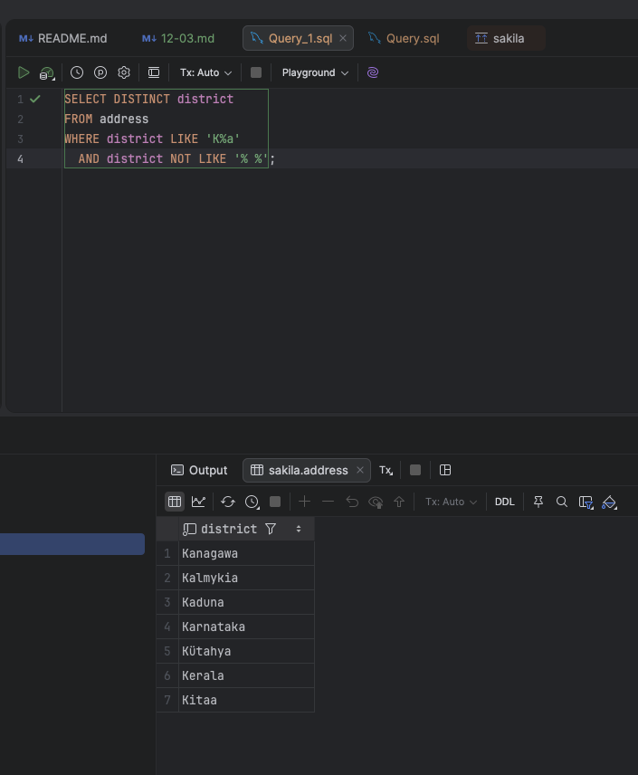
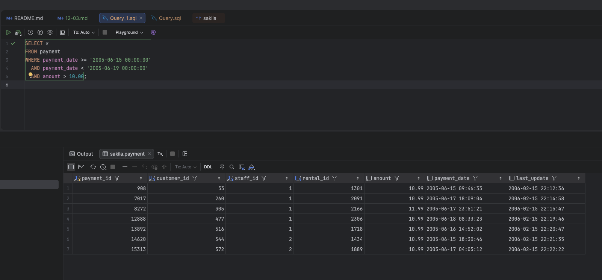
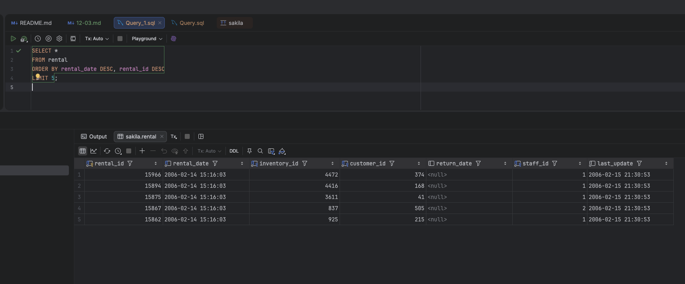
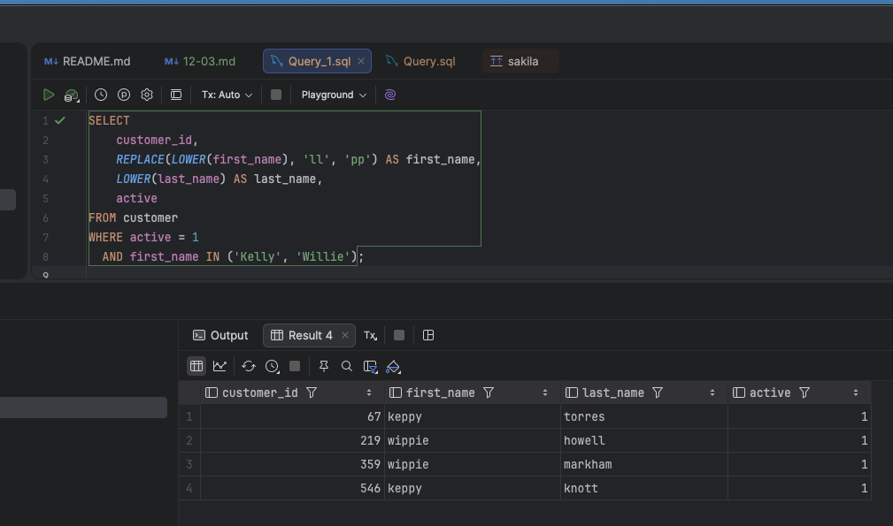
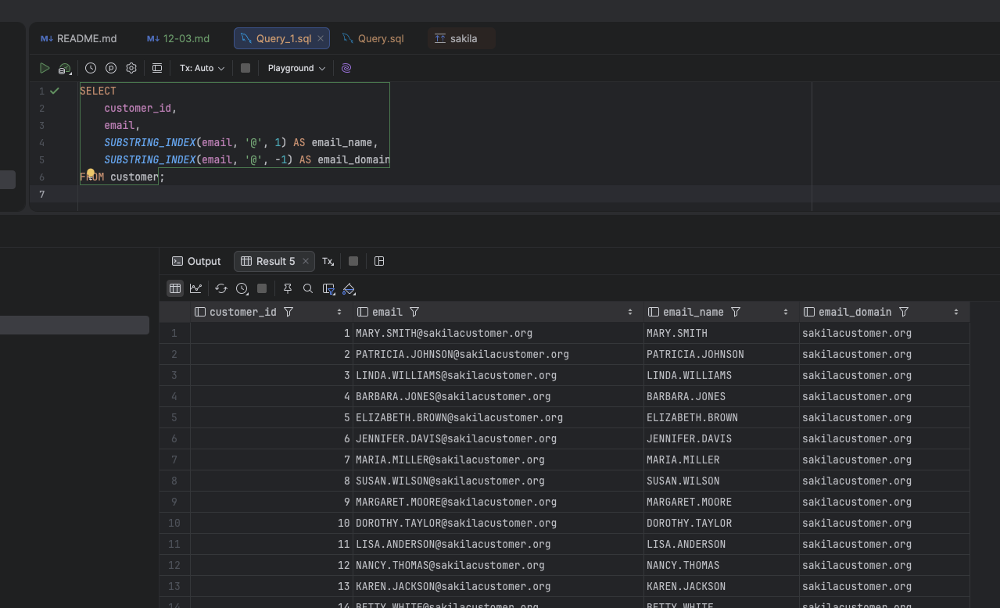
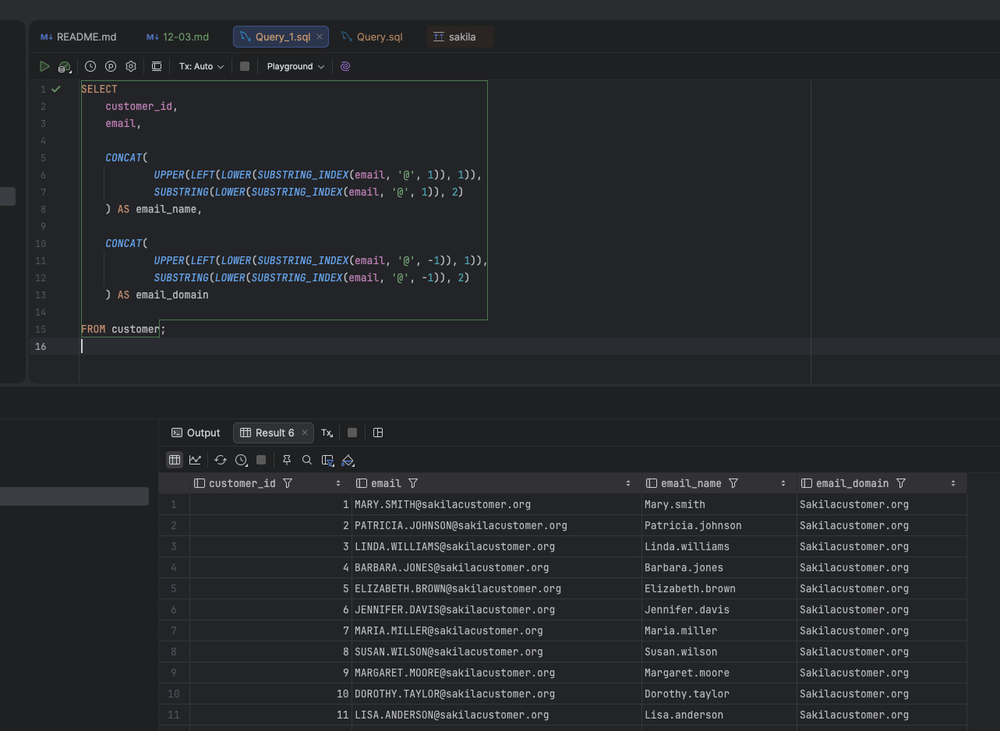

# Домашнее задание к занятию "`Работа с данными (DDL/DML)" - `Сергей Лелеко`
## База данных `sakila`

### Задание 1
Получаю уникальные названия районов из таблицы с адресами, которые начинаются на “K” и заканчиваются на “a” и не содержат пробелов.

Для этого нужно выполнить запрос
```sql
SELECT DISTINCT district
FROM address
WHERE district LIKE 'K%a'
  AND district NOT LIKE '% %';
```


### Задание 2
Получаю из таблицы платежей информацию по платежам, которые выполнялись с 15 июня 2005 года по 18 июня 2005 года включительно, и стоимость которых превышает 10.00.

Для этого составляю запрос включающий весь день 18 июня
```sql
SELECT *
FROM payment
WHERE payment_date >= '2005-06-15 00:00:00'
  AND payment_date < '2005-06-19 00:00:00'
  AND amount > 10.00;
```



### Задание 3
Получаю последние пять аренд фильмов.

Для этого составлю и выполню запрос:
```sql
SELECT *
FROM rental
ORDER BY rental_date DESC, rental_id DESC
LIMIT 5;
```


### Задание 4
Получаю одним запросом активных покупателей, имена которых `Kelly` или `Willie` , на лету привожу имена и фамилии в нижний регистр и заменяю буквы в именах `ll` на `pp`

Для этого составляю и выполняю запрос:
```sql
SELECT 
    customer_id,
    REPLACE(LOWER(first_name), 'll', 'pp') AS first_name,
    LOWER(last_name) AS last_name,
    active
FROM customer
WHERE active = 1
  AND first_name IN ('Kelly', 'Willie');
```


### Задание 5*
Вывожу Email каждого покупателя, разделив значение Email на две отдельные колонки, для этого составляю и выполняю запрос:
```sql
SELECT 
    customer_id,
    email,
    SUBSTRING_INDEX(email, '@', 1) AS email_name,
    SUBSTRING_INDEX(email, '@', -1) AS email_domain
FROM customer;
```


### Задание 6*
Теперь доработаю запрос из предыдущего задания: первая буква должна быть заглавной, остальные - строчными.

```sql
SELECT 
    customer_id,
    email,

    CONCAT(
        UPPER(LEFT(LOWER(SUBSTRING_INDEX(email, '@', 1)), 1)),
        SUBSTRING(LOWER(SUBSTRING_INDEX(email, '@', 1)), 2)
    ) AS email_name,

    CONCAT(
        UPPER(LEFT(LOWER(SUBSTRING_INDEX(email, '@', -1)), 1)),
        SUBSTRING(LOWER(SUBSTRING_INDEX(email, '@', -1)), 2)
    ) AS email_domain

FROM customer;
```
