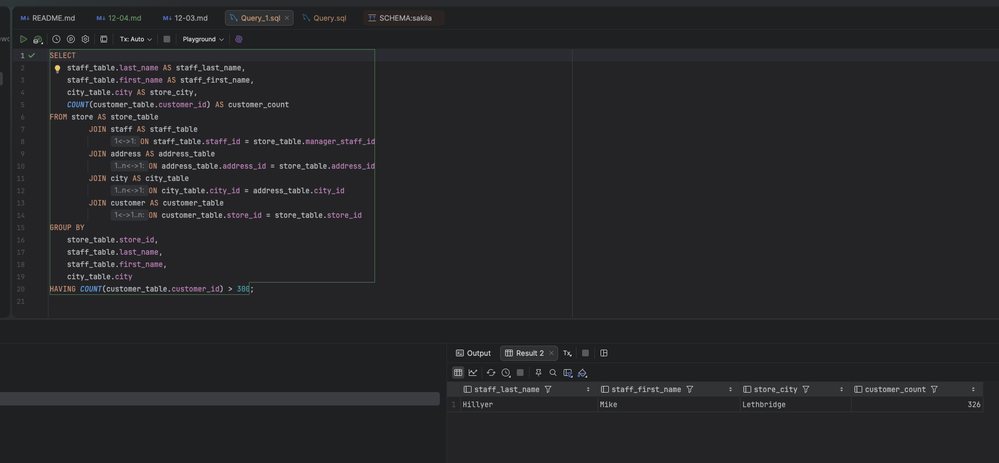
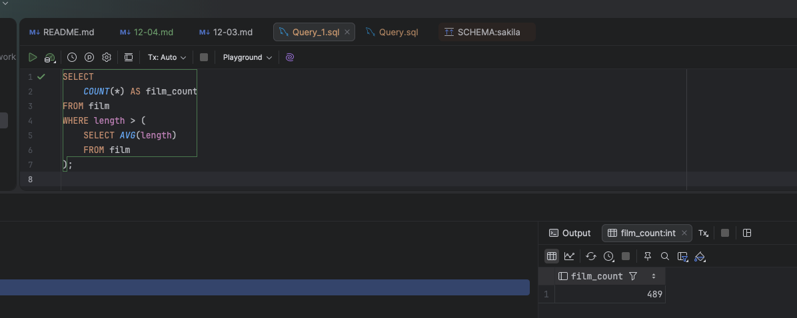
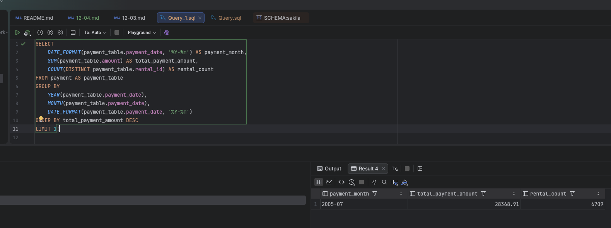
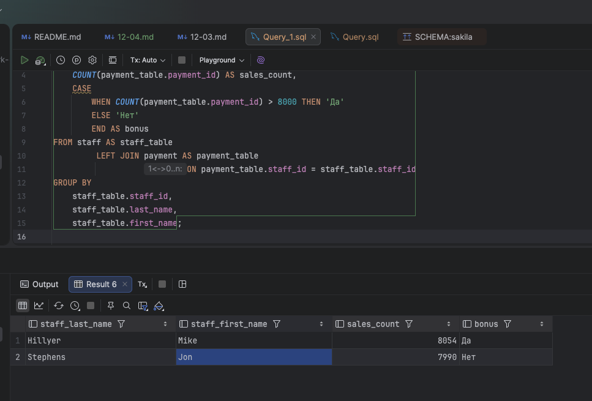
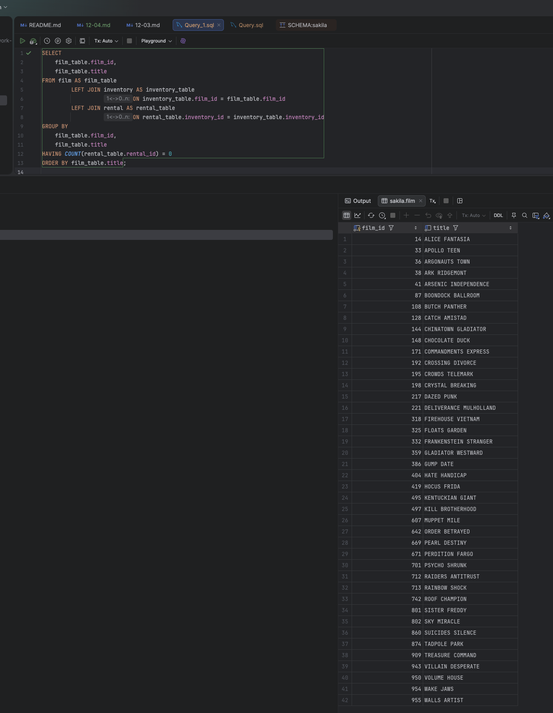

# Домашнее задание к занятию «SQL. Часть 2» - `Сергей Лелеко`
## База данных `sakila`

### Задание 1
Формирую и выполняю одним запросом получите информацию о магазине, в котором обслуживается более 300 покупателей, среди данных:

* фамилия и имя сотрудника из этого магазина;
* город нахождения магазина;
* количество пользователей, закреплённых в этом магазине.

```sql
SELECT
    staff_table.last_name AS staff_last_name,
    staff_table.first_name AS staff_first_name,
    city_table.city AS store_city,
    COUNT(customer_table.customer_id) AS customer_count
FROM store AS store_table
JOIN staff AS staff_table
    ON staff_table.staff_id = store_table.manager_staff_id
JOIN address AS address_table
    ON address_table.address_id = store_table.address_id
JOIN city AS city_table
    ON city_table.city_id = address_table.city_id
JOIN customer AS customer_table
    ON customer_table.store_id = store_table.store_id
GROUP BY
    store_table.store_id,
    staff_table.last_name,
    staff_table.first_name,
    city_table.city
HAVING COUNT(customer_table.customer_id) > 300;

```


### Задание 2
Получаю количество фильмов, продолжительность которых больше средней продолжительности всех фильмов.
(Тут используется агрегатная функция `AVG` для получения средней продолжительности фильма)

```sql
SELECT
    COUNT(*) AS film_count
FROM film
WHERE length > (
    SELECT AVG(length)
    FROM film
);
```


### Задание 3

Получаю информацию, за какой месяц была получена наибольшая сумма платежей, и добавляю информацию по количеству аренд за этот месяц.
Для этого формирую запрос с использованием форматирования дат, получением уникальных значений, группировкой и сортировкой полученных результатов
```sql
SELECT
    DATE_FORMAT(payment_table.payment_date, '%Y-%m') AS payment_month,
    SUM(payment_table.amount) AS total_payment_amount,
    COUNT(DISTINCT payment_table.rental_id) AS rental_count
FROM payment AS payment_table
GROUP BY
    YEAR(payment_table.payment_date),
    MONTH(payment_table.payment_date),
    DATE_FORMAT(payment_table.payment_date, '%Y-%m')
ORDER BY total_payment_amount DESC
LIMIT 1;
```



### Задание 4*
Подсчитаю количество продаж, выполненных каждым продавцом. Добавлю в результат вычисляемую колонку "Премия". Если количество продаж превышает 8000, то значение в колонке будет "Да", иначе должно быть значение "Нет".
```sql
SELECT
    staff_table.last_name AS staff_last_name,
    staff_table.first_name AS staff_first_name,
    COUNT(payment_table.payment_id) AS sales_count,
    CASE
        WHEN COUNT(payment_table.payment_id) > 8000 THEN 'Да'
        ELSE 'Нет'
        END AS bonus
FROM staff AS staff_table
         LEFT JOIN payment AS payment_table
                   ON payment_table.staff_id = staff_table.staff_id
GROUP BY
    staff_table.staff_id,
    staff_table.last_name,
    staff_table.first_name;
```


### Задание 5*
Получаю фильмы, которые ни разу не брали в аренду. Для этого формирую запрос:
```sql
SELECT
    film_table.film_id,
    film_table.title
FROM film AS film_table
LEFT JOIN inventory AS inventory_table
    ON inventory_table.film_id = film_table.film_id
LEFT JOIN rental AS rental_table
    ON rental_table.inventory_id = inventory_table.inventory_id
GROUP BY
    film_table.film_id,
    film_table.title
HAVING COUNT(rental_table.rental_id) = 0
ORDER BY film_table.title;

```
Этот запрос найдёт фильмы, которые ни разу не были взяты в аренду, включая фильмы, у которых вообще нет экземпляров в таблице `inventory`.
