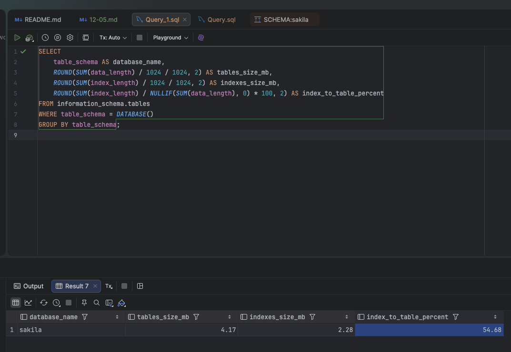
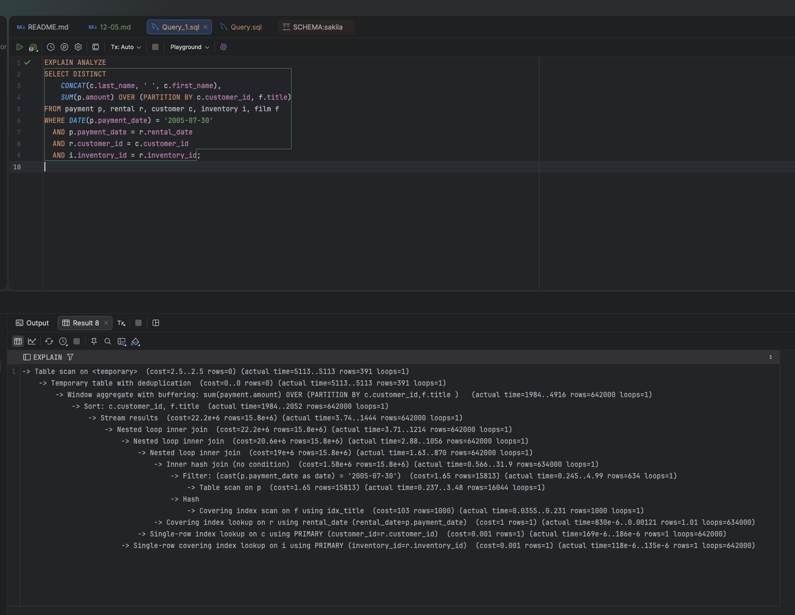
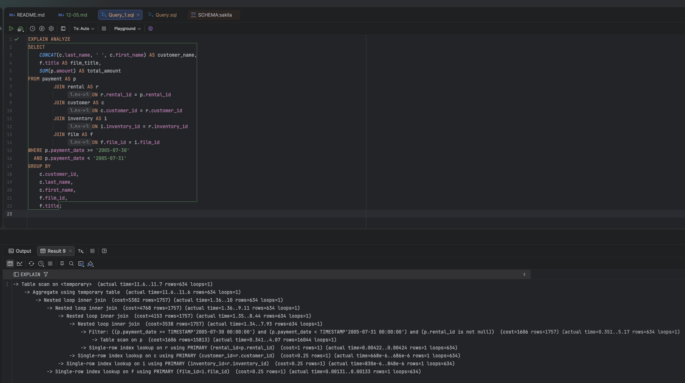

# Домашнее задание к занятию «Индексы» - `Сергей Лелеко`
## База данных `sakila`

### Задание 1
Составляю запрос, который показывает процентное отношение общего размера индексов к общему размеру таблиц в текущей базе данных:

```sql
SELECT 
    table_schema AS database_name,
    ROUND(SUM(data_length) / 1024 / 1024, 2) AS tables_size_mb,
    ROUND(SUM(index_length) / 1024 / 1024, 2) AS indexes_size_mb,
    ROUND(SUM(index_length) / NULLIF(SUM(data_length), 0) * 100, 2) AS index_to_table_percent
FROM information_schema.tables
WHERE table_schema = DATABASE()
GROUP BY table_schema;

```
В MySQL для таблиц InnoDB поле DATA_LENGTH показывает приблизительный объём, занятый данными/кластерным индексом, а INDEX_LENGTH — приблизительный объём, занятый некластерными индексами. Поэтому для учебного задания корректно использовать именно SUM(index_length) / SUM(data_length) * 100.



### Задание 2
Сначала проведу EXPLAIN ANALYZE исходного запроса:
```sql
EXPLAIN ANALYZE
SELECT DISTINCT 
    CONCAT(c.last_name, ' ', c.first_name),
    SUM(p.amount) OVER (PARTITION BY c.customer_id, f.title)
FROM payment p, rental r, customer c, inventory i, film f
WHERE DATE(p.payment_date) = '2005-07-30'
  AND p.payment_date = r.rental_date
  AND r.customer_id = c.customer_id
  AND i.inventory_id = r.inventory_id;

```



#### Узкие места исходного запроса:

1. Используется старый стиль соединения таблиц через запятую:
```sql
FROM payment p, rental r, customer c, inventory i, film f
```
Такой вариант хуже читается и повышает риск ошибки в условиях соединения. 

2. Таблица film f не связана с таблицей inventory i.
В запросе нет условия:
```sql
f.film_id = i.film_id
```
Из-за этого возникает лишнее декартово произведение с таблицей film, то есть количество строк искусственно увеличивается. 

3. Условие:
```sql
DATE(p.payment_date) = '2005-07-30'
```

плохо для индекса, потому что функция DATE() применяется к колонке. Лучше фильтровать диапазоном дат. 

4. Условие:
```sql
p.payment_date = r.rental_date
```
выглядит логически неправильным для базы Sakila. Обычно payment связывается с rental через rental_id. 

5. Используются одновременно DISTINCT и оконная функция:
```sql
SUM(p.amount) OVER (...)
```
Это может приводить к созданию временной таблицы, сортировкам и удалению дублей уже после выполнения большого объёма работы.

#### Оптимизация
Поэтому составлю более корректный вариант запроса:

```sql
SELECT 
    CONCAT(c.last_name, ' ', c.first_name) AS customer_name,
    f.title AS film_title,
    SUM(p.amount) AS total_amount
FROM payment AS p
JOIN rental AS r 
    ON r.rental_id = p.rental_id
JOIN customer AS c 
    ON c.customer_id = r.customer_id
JOIN inventory AS i 
    ON i.inventory_id = r.inventory_id
JOIN film AS f 
    ON f.film_id = i.film_id
WHERE p.payment_date >= '2005-07-30'
  AND p.payment_date < '2005-07-31'
GROUP BY 
    c.customer_id,
    c.last_name,
    c.first_name,
    f.film_id,
    f.title;

```
И сразу проведу его анализ:


Для ускорения фильтрации по дате платежа и соединения с арендой можно добавить индекс:
```sql 
CREATE INDEX idx_payment_payment_date_rental_id
ON payment (payment_date, rental_id);
```

#### После оптимизации:
* вместо неявных соединений через запятую использованы явные `JOIN`;
* устранено лишнее декартово произведение с таблицей film;
* условие `DATE(p.payment_date) = ...` заменено на диапазон дат, что позволяет эффективнее использовать индекс;
* оконная функция и `DISTINCT` заменены на обычную агрегацию `GROUP BY`;
* добавлен индекс по `payment(payment_date, rental_id)`;
* план запроса должен стать проще, а количество обрабатываемых строк меньше.

### Задание 3*

В PostgreSQL, в отличие от MySQL, доступны специализированные типы индексов `GiST`, `SP-GiST`, `GIN`, `BRIN` и `bloom`. 
Они позволяют эффективнее работать со сложными типами данных: массивами, JSONB, диапазонами, геометрическими объектами, полнотекстовым поиском и очень большими таблицами. 
В MySQL основные типы индексов `B-tree`, `hash` для MEMORY-таблиц, `FULLTEXT` и `SPATIAL`, поэтому прямых аналогов `GiST`, `SP-GiST`, `GIN`, `BRIN` и `bloom` в MySQL нет.