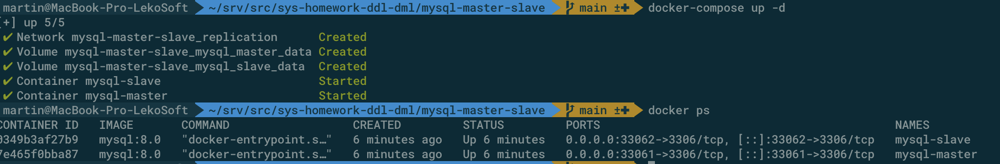
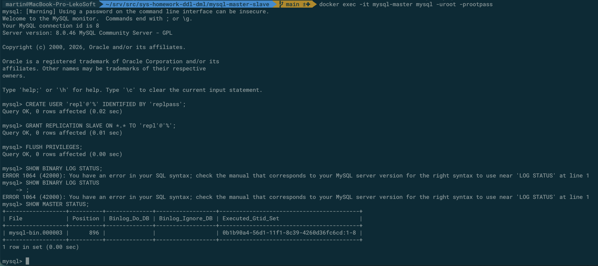
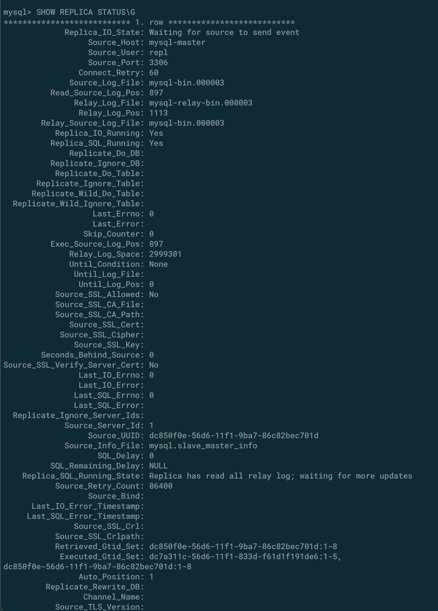

# Домашнее задание к занятию «Репликация и масштабирование. Часть 1» - `Сергей Лелеко`

### Задание 1

Master-slave - это схема репликации, при которой есть один основной сервер базы данных — `master`, и один или несколько подчинённых серверов - `slave`.
На `master` выполняются операции записи: 
```sql 
INSERT, UPDATE, DELETE
```
На `slave` обычно выполняются операции чтения: 
```sql
SELECT
```

**Принцип работы:**
1. Master записывает изменения в бинарный журнал — binary log.
2. Slave получает эти изменения и сохраняет их в свой relay log.
3. Slave применяет изменения к своей копии данных.
      
Такая схема удобна для масштабирования чтения и повышения отказоустойчивости. Например, приложение может писать данные только в master, а часть запросов на чтение отправлять на slave. Это снижает нагрузку на основной сервер.
Master-master - это схема, при которой оба сервера являются ведущими. Каждый сервер может принимать операции чтения и записи, а затем передавать изменения другому серверу. По сути, это master-slave репликация, настроенная в обе стороны.

| **Критерий**                   | **Master-slave**                          | **Master-master**                             |
|--------------------------------|-------------------------------------------|-----------------------------------------------|
| Количество серверов для записи | Один master                               | Два или более master                          |
| Чтение                         | Можно читать со slave                     | Можно читать с любого master                  |
| Запись                         | Только на master                          | Можно писать на оба сервера                   |
| Сложность настройки            | Ниже                                      | Выше                                          |
| Риск конфликтов                | Минимальный                               | Есть риск конфликтов при одновременной записи |
| Типичный сценарий              | Масштабирование чтения, резервная реплика | Высокая доступность, распределённая запись    |

Еще главный момент: репликация не заменяет резервное копирование. Если случайно удалить данные на master, это удаление также попадёт на реплику. Поэтому бэкапы нужно делать отдельно.

### Задание 2
Создаю конфигурацию для тестирования репликации в режимах master-slave и master-master.

Для этого составляется [docker-compose.yml](mysql-master-slave/docker-compose.yml)
```yml
services:
  mysql-master:
    image: mysql:8.0
    container_name: mysql-master
    restart: unless-stopped
    environment:
      MYSQL_ROOT_PASSWORD: rootpass
    ports:
      - "33061:3306"
    volumes:
      - mysql_master_data:/var/lib/mysql
      - ./master.cnf:/etc/mysql/conf.d/master.cnf:ro
    networks:
      - replication

  mysql-slave:
    image: mysql:8.0
    container_name: mysql-slave
    restart: unless-stopped
    environment:
      MYSQL_ROOT_PASSWORD: rootpass
    ports:
      - "33062:3306"
    volumes:
      - mysql_slave_data:/var/lib/mysql
      - ./slave.cnf:/etc/mysql/conf.d/slave.cnf:ro
    networks:
      - replication

volumes:
  mysql_master_data:
  mysql_slave_data:

networks:
  replication:
    driver: bridge
```
и два конфигурационных файла для [master](mysql-master-slave/master.cnf) и [slave](mysql-master-slave/slave.cnf) серверов mysql.

Master:
```cnf
[mysqld]
server-id=1
log-bin=mysql-bin
binlog_format=ROW
gtid_mode=ON
enforce_gtid_consistency=ON
```

Slave:
```cnf
[mysqld]
server-id=2
relay-log=mysql-relay-bin
read_only=ON
super_read_only=ON
gtid_mode=ON
enforce_gtid_consistency=ON
```

Запускаю и проверяю сформированный докер стек:


Далее захожу в контейнер master сервера mysql

```shell
docker exec -it mysql-master mysql -uroot -prootpass
```

После этого выполняю поочередно команды:
```sql
CREATE USER 'repl'@'%' IDENTIFIED BY 'replpass';

GRANT REPLICATION SLAVE ON *.* TO 'repl'@'%';

FLUSH PRIVILEGES;

-- Для MySQL 8.0 (в моем случае):
SHOW MASTER STATUS;

-- Для MySQL 8.4+:
SHOW BINARY LOG STATUS;

```



Теперь выполняю процедуру настройки для slave

```shell
docker exec -it mysql-slave mysql -uroot -prootpass
```

Внутри последовательно выполняем запросы для настройки репликации с master и ее запуск
```sql
CHANGE REPLICATION SOURCE TO
  SOURCE_HOST='mysql-master',
  SOURCE_USER='repl',
  SOURCE_PASSWORD='replpass',
  SOURCE_AUTO_POSITION=1,
  GET_SOURCE_PUBLIC_KEY=1;

START REPLICA;

SHOW REPLICA STATUS\G
```


### Задание 3*