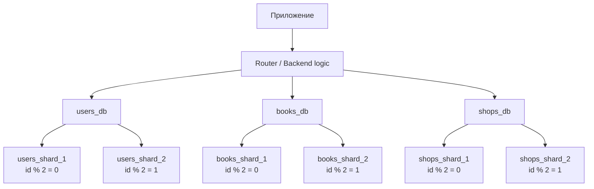
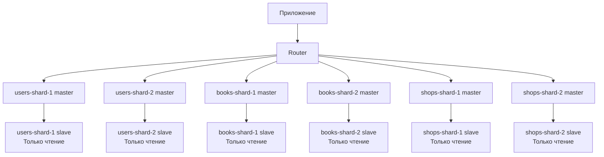

# Домашнее задание к занятию «Репликация и масштабирование. Часть 2» - `Сергей Лелеко`

### Задание 1
1. **Активный master-сервер и пассивный репликационный slave-сервер**

   При такой схеме основной сервер работает в режиме `master` принимает все операции чтения и записи. 
    Второй сервер работает как `slave` он получает копию данных с master-сервера, но обычно не используется для обычной пользовательской нагрузки.

   Основные преимущества:
   1.	Повышение отказоустойчивости
         Если основной master-сервер выходит из строя, slave-сервер можно переключить в режим master и продолжить работу системы.
   2.	Быстрое восстановление после аварии
         Так как на slave-сервере уже есть актуальная или почти актуальная копия данных, восстановление занимает меньше времени, чем восстановление из резервной копии.
   3.	Снижение риска потери данных
         Реплика хранит копию данных. При сбое основного сервера данные можно восстановить со slave-сервера.
   4.	Возможность выполнять резервное копирование без нагрузки на master
         Бэкапы можно делать со slave-сервера, чтобы не нагружать основной сервер.
   5.	Простая архитектура
         Такая схема проще в настройке и сопровождении по сравнению с более сложными кластерами.
   
   Недостаток этой схемы в том, что пассивный slave обычно не разгружает master по чтению. Он нужен в первую очередь для отказоустойчивости и резервирования.

2. Master-сервер и несколько slave-серверов

   В этой схеме один master-сервер принимает операции записи, а несколько slave-серверов получают с него копии данных. Чтение можно распределять между slave-серверами.

     Основные преимущества:
   1. Масштабирование чтения
           Большинство веб-приложений выполняют намного больше операций чтения, чем записи. Например: просмотр товаров, книг, профилей, заказов. Эти запросы можно отправлять на slave-серверы.
   2.	Снижение нагрузки на `master`
         Master занимается в основном записью данных, а чтение, отчёты и аналитика могут выполняться на slave-серверах.
   3.	Повышение отказоустойчивости
         Если один slave-сервер выходит из строя, остальные продолжают работать.
   4.	Разделение задач между slave-серверами
         Например:
         o	один `slave` - для пользовательских запросов чтения;
         o	второй `slave` - для отчётов;
         o	третий `slave` - для резервного копирования;
         o	четвёртый `slave` - для аналитики.
   5.	Географическое распределение
         Slave-серверы можно размещать ближе к пользователям в разных регионах. Это уменьшает задержку при чтении данных.
   
   Недостаток схемы - возможная задержка репликации. Данные на `slave` могут обновляться не мгновенно, поэтому для критически важных операций после записи лучше читать данные с master-сервера.

### Задание 2
**План горизонтального и вертикального шардинга базы данных**

Есть база данных из трёх таблиц:

•	users - пользователи;

•	books - книги;

•	shops - магазины.

Пример структуры таблиц:
```yml
users:
- id
- full_name
- email
- region
- created_at

books:
- id
- title
- author
- price
- category
- created_at

shops:
- id
- title
- city
- address
- created_at
```

1. **Вертикальный шардинг**

   Вертикальный шардинг - это разделение базы данных по логическим областям. Вместо одной общей базы создаём несколько отдельных баз:

    `users_db` - хранит пользователей

    `books_db` - хранит книги
   
    `shops_db` - хранит магазины

    Преимущества вертикального шардинга:

    •	уменьшается нагрузка на одну общую базу;

    •	проще масштабировать отдельные части системы;
    
    •	можно независимо обслуживать разные базы;
    
    •	сбой в одной части системы не всегда приводит к полной остановке всего приложения;
    
    •	можно назначать разные серверы под разные типы нагрузки.

    Например, таблица `books` может использоваться чаще всего, потому что пользователи часто просматривают каталог. Значит, сервер с книгами можно масштабировать отдельно.

2. **Горизонтальный шардинг**

Горизонтальный шардинг - это разделение строк одной таблицы между несколькими базами.

Например, таблицу `users` можно разделить так:

    users_shard_1 — пользователи с чётным id
    
    users_shard_2 — пользователи с нечётным id

Таблицу `books`:

    books_shard_1 — книги с чётным id

    books_shard_2 — книги с нечётным id

Таблицу `shops`:

    shops_shard_1 — магазины с чётным id

    shops_shard_2 — магазины с нечётным id

Принцип маршрутизации:

    shard = id % 2

Если результат `0`, данные идут в первый shard.
Если результат `1`, данные идут во второй shard.


**Схема шардинга**


Где что будет располагаться?

| **Сервер**      | **Режим**           | **Что хранит**              |
|-----------------|---------------------|-----------------------------|
| `users-shard-1` | master, read/write  | пользователи с `id % 2 = 0` |
| `users-shard-2` | master, read/write  | пользователи с `id % 2 = 1` |
| `books-shard-1` | master, read/write  | книги с `id % 2 = 0`        |
| `books-shard-2` | master, read/write  | книги с `id % 2 = 1`        |
| `shops-shard-1` | master, read/write  | магазины с `id % 2 = 0`     |
| `shops-shard-2` | master, read/write  | магазины с `id % 2 = 1`     |

Каждый shard работает как самостоятельный master-сервер для своего набора данных.

Если нужно повысить отказоустойчивость, для каждого master-shard можно добавить slave-сервер:



**Режимы работы серверов**

Master-серверы принимают:

• INSERT;

• UPDATE;

• DELETE;

• критически важные SELECT, если нужно сразу получить самые свежие данные.

Slave-серверы работают в режиме read only.
Они используются для:

• чтения данных;

• отчётов;

• аналитики;

• резервного копирования;

• быстрого переключения при аварии master-сервера.

**Принципы работы приложения**

Приложение не должно напрямую обращаться к одной общей базе. Оно должно использовать routing-логику.

Пример логики:

    Если нужен пользователь с id = 10:
    10 % 2 = 0
    Значит, обращаемся к users_shard_1.
    
    Если нужна книга с id = 15:
    15 % 2 = 1
    Значит, обращаемся к books_shard_2.
    
    Если нужен магазин с id = 8:
    8 % 2 = 0
    Значит, обращаемся к shops_shard_1.

### Задание 3*

Ниже пример настройки выбранного шардинга через Docker Compose.

Будет создано 6 отдельных MySQL-серверов:

`users-shard-1`

`users-shard-2`

`books-shard-1`

`books-shard-2`

`shops-shard-1`

`shops-shard-2`

**Структура проекта**

```yaml
sql-sharding/:
  - docker-compose.yml
  init/:
    - users-shard-1.sql
    - users-shard-2.sql
    - books-shard-1.sql
    - books-shard-2.sql
    - shops-shard-1.sql
    - shops-shard-2.sql
```

Далее составлю листинги кода:

1. **docker-compose.yml**
    ```yaml
    services:
        users-shard-1:
            image: mysql:8.0
            container_name: users-shard-1
            restart: unless-stopped
            environment:
                MYSQL_ROOT_PASSWORD: root
                MYSQL_DATABASE: users_db
            ports:
             - "33061:3306"
            volumes:
             - users_shard_1_data:/var/lib/mysql
             - ./init/users-shard-1.sql:/docker-entrypoint-initdb.d/init.sql
        
        users-shard-2:
            image: mysql:8.0
            container_name: users-shard-2
            restart: unless-stopped
            environment:
                MYSQL_ROOT_PASSWORD: root
                MYSQL_DATABASE: users_db
            ports:
            - "33062:3306"
            volumes:
            - users_shard_2_data:/var/lib/mysql
            - ./init/users-shard-2.sql:/docker-entrypoint-initdb.d/init.sql
        
        books-shard-1:
            image: mysql:8.0
            container_name: books-shard-1
            restart: unless-stopped
            environment:
                MYSQL_ROOT_PASSWORD: root
                MYSQL_DATABASE: books_db
            ports:
            - "33063:3306"
            volumes:
            - books_shard_1_data:/var/lib/mysql
            - ./init/books-shard-1.sql:/docker-entrypoint-initdb.d/init.sql
        
        books-shard-2:
            image: mysql:8.0
            container_name: books-shard-2
            restart: unless-stopped
            environment:
                MYSQL_ROOT_PASSWORD: root
                MYSQL_DATABASE: books_db
            ports:
            - "33064:3306"
            volumes:
            - books_shard_2_data:/var/lib/mysql
            - ./init/books-shard-2.sql:/docker-entrypoint-initdb.d/init.sql
        
        shops-shard-1:
            image: mysql:8.0
            container_name: shops-shard-1
            restart: unless-stopped
            environment:
                MYSQL_ROOT_PASSWORD: root
                MYSQL_DATABASE: shops_db
            ports:
            - "33065:3306"
            volumes:
            - shops_shard_1_data:/var/lib/mysql
            - ./init/shops-shard-1.sql:/docker-entrypoint-initdb.d/init.sql
        
        shops-shard-2:
            image: mysql:8.0
            container_name: shops-shard-2
            restart: unless-stopped
            environment:
                MYSQL_ROOT_PASSWORD: root
                MYSQL_DATABASE: shops_db
            ports:
            - "33066:3306"
            volumes:
            - shops_shard_2_data:/var/lib/mysql
            - ./init/shops-shard-2.sql:/docker-entrypoint-initdb.d/init.sql
        
        volumes:
            users_shard_1_data:
            users_shard_2_data:
            books_shard_1_data:
            books_shard_2_data:
            shops_shard_1_data:
            shops_shard_2_data:
    ```

2. **init/users-shard-1.sql**
    ```mysql
    CREATE DATABASE IF NOT EXISTS users_db;
    
    USE users_db;
    
    CREATE TABLE users (
    id BIGINT PRIMARY KEY,
    full_name VARCHAR(255) NOT NULL,
    email VARCHAR(255) NOT NULL UNIQUE,
    region VARCHAR(100) NOT NULL,
    created_at TIMESTAMP DEFAULT CURRENT_TIMESTAMP,
    CONSTRAINT users_shard_1_check CHECK (MOD(id, 2) = 0)
    );
    
    INSERT INTO users (id, full_name, email, region)
    VALUES
    (2, 'Иван Петров', 'ivan@example.com', 'Москва'),
    (4, 'Алексей Сидоров', 'alexey@example.com', 'Казань');
    
    ```
3. **init/users-shard-2.sql**
    ```mysql
   CREATE DATABASE IF NOT EXISTS users_db;

    USE users_db;
    
    CREATE TABLE users (
    id BIGINT PRIMARY KEY,
    full_name VARCHAR(255) NOT NULL,
    email VARCHAR(255) NOT NULL UNIQUE,
    region VARCHAR(100) NOT NULL,
    created_at TIMESTAMP DEFAULT CURRENT_TIMESTAMP,
    CONSTRAINT users_shard_2_check CHECK (MOD(id, 2) = 1)
    );
    
    INSERT INTO users (id, full_name, email, region)
    VALUES
    (1, 'Анна Иванова', 'anna@example.com', 'Санкт-Петербург'),
    (3, 'Мария Смирнова', 'maria@example.com', 'Екатеринбург');
    ```
4. **init/books-shard-1.sql**
    ```mysql
   CREATE DATABASE IF NOT EXISTS books_db;

    USE books_db;
    
    CREATE TABLE books (
    id BIGINT PRIMARY KEY,
    title VARCHAR(255) NOT NULL,
    author VARCHAR(255) NOT NULL,
    category VARCHAR(100) NOT NULL,
    price DECIMAL(10, 2) NOT NULL,
    created_at TIMESTAMP DEFAULT CURRENT_TIMESTAMP,
    CONSTRAINT books_shard_1_check CHECK (MOD(id, 2) = 0)
    );
    
    INSERT INTO books (id, title, author, category, price)
    VALUES
    (2, 'MySQL для начинающих', 'Павел Орлов', 'Databases', 1200.00),
    (4, 'Архитектура приложений', 'Игорь Волков', 'Software', 1800.00);

    ```
5. **init/books-shard-2.sql**
    ```mysql
   CREATE DATABASE IF NOT EXISTS books_db;

    USE books_db;
    
    CREATE TABLE books (
    id BIGINT PRIMARY KEY,
    title VARCHAR(255) NOT NULL,
    author VARCHAR(255) NOT NULL,
    category VARCHAR(100) NOT NULL,
    price DECIMAL(10, 2) NOT NULL,
    created_at TIMESTAMP DEFAULT CURRENT_TIMESTAMP,
    CONSTRAINT books_shard_2_check CHECK (MOD(id, 2) = 1)
    );
    
    INSERT INTO books (id, title, author, category, price)
    VALUES
    (1, 'SQL. Быстрый старт', 'Сергей Кузнецов', 'Databases', 900.00),
    (3, 'Высоконагруженные системы', 'Андрей Морозов', 'Software', 2100.00);
    ```
6. **init/shops-shard-1.sql**
    ```mysql
   CREATE DATABASE IF NOT EXISTS shops_db;

    USE shops_db;
    
    CREATE TABLE shops (
    id BIGINT PRIMARY KEY,
    title VARCHAR(255) NOT NULL,
    city VARCHAR(100) NOT NULL,
    address VARCHAR(255) NOT NULL,
    created_at TIMESTAMP DEFAULT CURRENT_TIMESTAMP,
    CONSTRAINT shops_shard_1_check CHECK (MOD(id, 2) = 0)
    );
    
    INSERT INTO shops (id, title, city, address)
    VALUES
    (2, 'Книжный склад Север', 'Москва', 'ул. Северная, 10'),
    (4, 'Book Market', 'Казань', 'ул. Центральная, 15');
    ```
7. **init/shops-shard-2.sql**
    ```mysql
   CREATE DATABASE IF NOT EXISTS shops_db;

    USE shops_db;
    
    CREATE TABLE shops (
    id BIGINT PRIMARY KEY,
    title VARCHAR(255) NOT NULL,
    city VARCHAR(100) NOT NULL,
    address VARCHAR(255) NOT NULL,
    created_at TIMESTAMP DEFAULT CURRENT_TIMESTAMP,
    CONSTRAINT shops_shard_2_check CHECK (MOD(id, 2) = 1)
    );
    
    INSERT INTO shops (id, title, city, address)
    VALUES
    (1, 'Главный книжный', 'Санкт-Петербург', 'Невский проспект, 1'),
    (3, 'Книги онлайн', 'Екатеринбург', 'ул. Ленина, 20');

    ```