# Домашнее задание к занятию "`Работа с данными (DDL/DML)" - `Сергей Лелеко`


### Инструкция по выполнению домашнего задания

   1. Сделайте `fork` данного репозитория к себе в Github и переименуйте его по названию или номеру занятия, например, https://github.com/имя-вашего-репозитория/git-hw или  https://github.com/имя-вашего-репозитория/7-1-ansible-hw).
   2. Выполните клонирование данного репозитория к себе на ПК с помощью команды `git clone`.
   3. Выполните домашнее задание и заполните у себя локально этот файл README.md:
      - впишите вверху название занятия и вашу фамилию и имя
      - в каждом задании добавьте решение в требуемом виде (текст/код/скриншоты/ссылка)
      - для корректного добавления скриншотов воспользуйтесь [инструкцией "Как вставить скриншот в шаблон с решением](https://github.com/netology-code/sys-pattern-homework/blob/main/screen-instruction.md)
      - при оформлении используйте возможности языка разметки md (коротко об этом можно посмотреть в [инструкции  по MarkDown](https://github.com/netology-code/sys-pattern-homework/blob/main/md-instruction.md))
   4. После завершения работы над домашним заданием сделайте коммит (`git commit -m "comment"`) и отправьте его на Github (`git push origin`);
   5. В личном кабинете прикрепите и отправьте ссылку на решение в виде md-файла в вашем Github.
   6. Любые вопросы по выполнению заданий спрашивайте в разделе “Вопросы по заданию” в личном кабинете.
   
Желаем успехов в выполнении домашнего задания!
   
### Дополнительные материалы, которые могут быть полезны для выполнения задания

1. [Руководство по оформлению Markdown файлов](https://gist.github.com/Jekins/2bf2d0638163f1294637#Code)

---

### Задание 1

1.1. Сначала поднимаю сервер бд и настраиваю доступ в докере
   ```shell
      docker run --name mysql-sakila-ddl-dml \
      -e MYSQL_ROOT_PASSWORD=rootpass \
      -p 3306:3306 \
      -d mysql:8.0
```
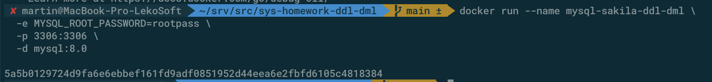
      
Вхожу в запущенный ранее MySQL под рутом командой:
```shell
docker exec -it mysql-sakila-ddl-dml mysql -uroot -prootpass
```
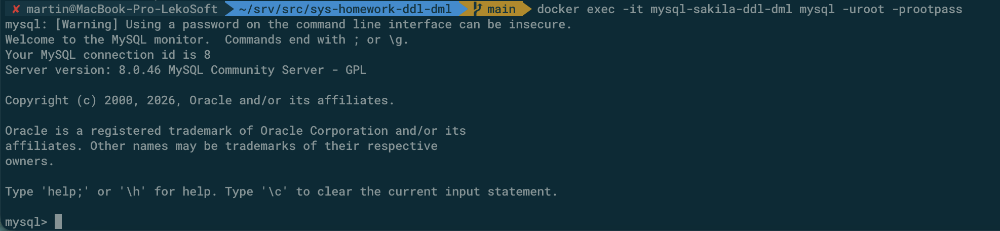
   
1.2. Создаю учетную запись `sys_temp`
```sql
CREATE USER 'sys_temp'@'%' IDENTIFIED BY 'password';
```
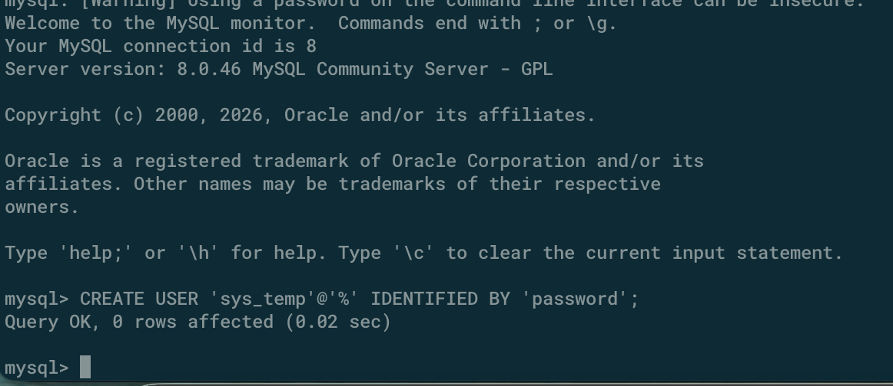

1.3. Получаю список пользователей бд командой:
```sql
SELECT user, host, plugin
FROM mysql.user
ORDER BY user, host;
```
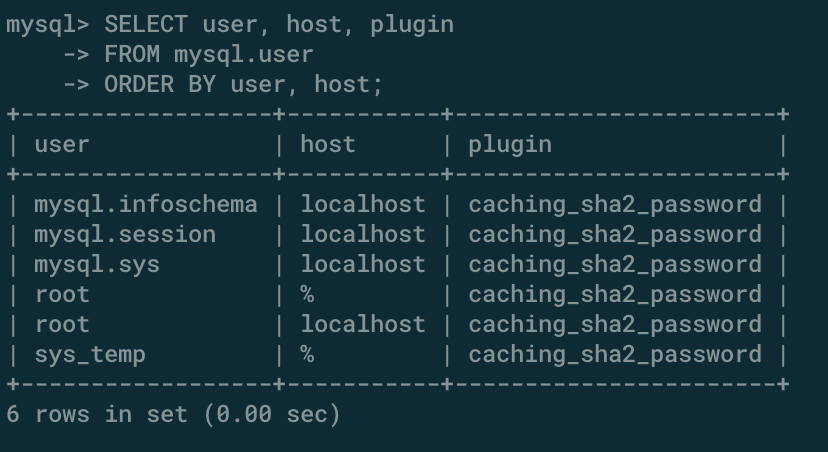

1.4. Даю все права пользователю `sys_temp` и перезагружаю привилегии
```sql
GRANT ALL PRIVILEGES ON *.* TO 'sys_temp'@'%' WITH GRANT OPTION;

FLUSH PRIVILEGES;
```
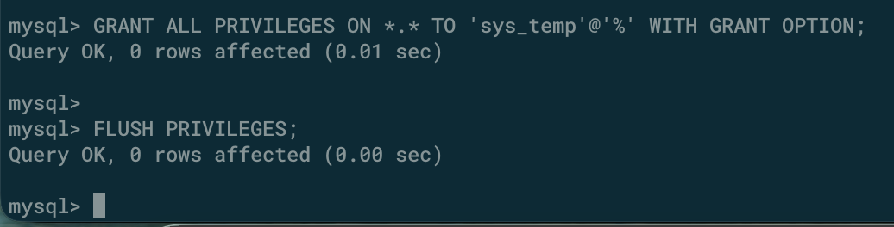

1.5. Запрашиваю права пользователя `sys_temp`
```sql
SHOW GRANTS FOR 'sys_temp'@'%';
```
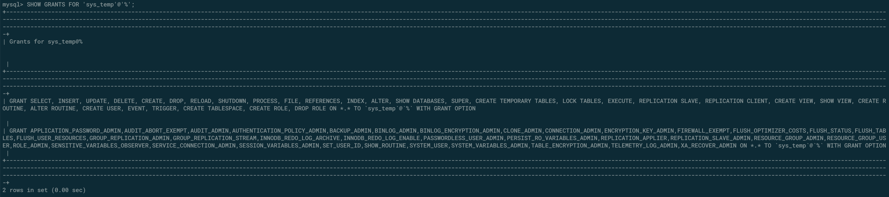

1.6. Меняю тип аутентификации с sha2 используя запрос: 
```sql
ALTER USER 'sys_temp'@'%' IDENTIFIED WITH mysql_native_password BY 'password';
```
Затем выхожу из сеанса, который был под пользователем `root`
```sql
EXIT
```
После этого вхожу уже под пользователем `sys_temp` и его паролем `password`
```shell
docker exec -it mysql-sakila-ddl-dml mysql -usys_temp -ppassword -h127.0.0.1
```
и проверяю текущего пользователя уже внутри mysql
```sql
SELECT CURRENT_USER();
```
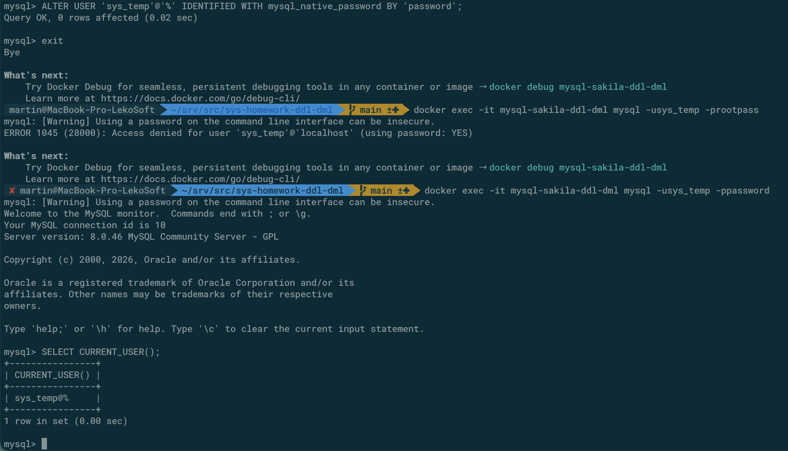

1.7. Скачиваю дамп базы `sakila-db`, копирую его в докер контейнер и востанавливаю 

Скачивание и распаковка на хосте
```shell
curl -L -o sakila-db.zip https://downloads.mysql.com/docs/sakila-db.zip
unzip sakila-db.zip
```

Затем копирование распакованного дампа в контейнер в отдельную директорию
```shell
docker cp sakila-db mysql-sakila-ddl-dml:/tmp/sakila-db
```
повторный вход в контейнер с базой под пользователем `sys_temp`
```shell
docker exec -it mysql-sakila-ddl-dml mysql -usys_temp -ppassword
```

И восстановление дампа внутри mysql контейнера:
```shell
SOURCE /tmp/sakila-db/sakila-schema.sql;
SOURCE /tmp/sakila-db/sakila-data.sql;
```

Ниже скриншоты:
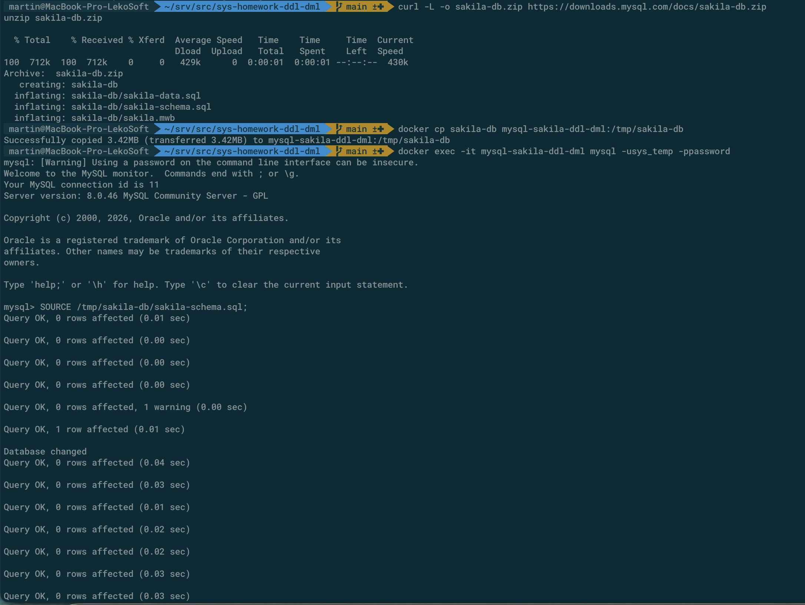

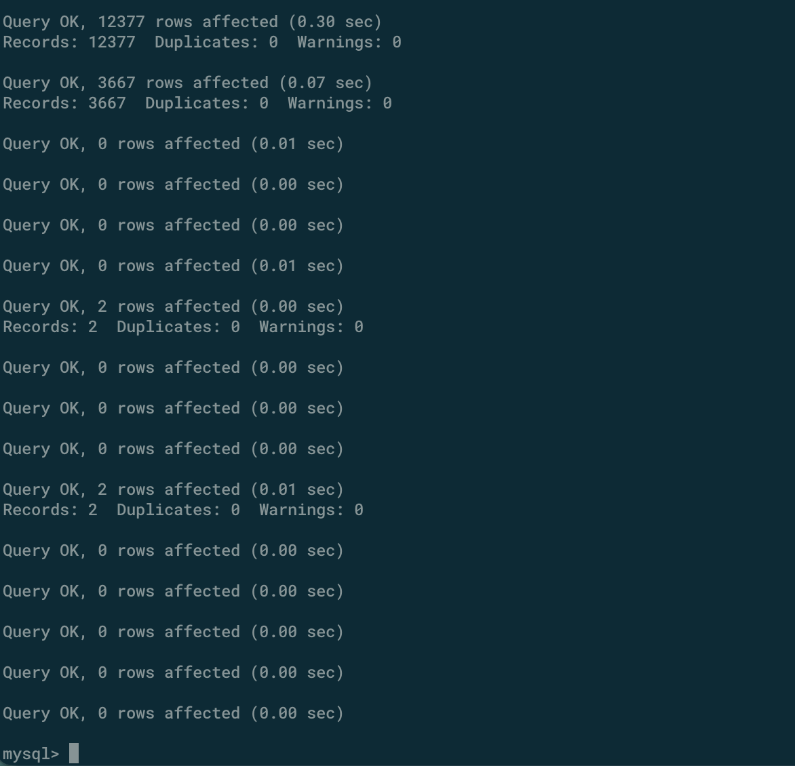

Проверяю что база появилась
```sql
SHOW DATABASES;
```
И выбираю ее:
```sql
USE sakila;
```

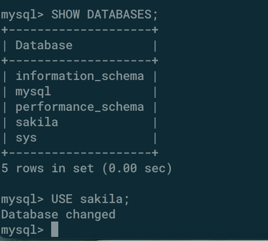

1.8. Диаграмма базы данных `sakila`
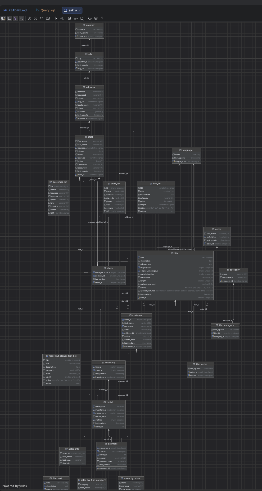

#### Простыня всех запросов
```sql
-- 1.2. Создание пользователя
CREATE USER 'sys_temp'@'%' IDENTIFIED BY 'password';

-- Если нужно сменить тип аутентификации
ALTER USER 'sys_temp'@'%' IDENTIFIED WITH mysql_native_password BY 'password';

-- 1.3. Список пользователей
SELECT user, host, plugin
FROM mysql.user
ORDER BY user, host;

-- 1.4. Выдача всех прав
GRANT ALL PRIVILEGES ON *.* TO 'sys_temp'@'%' WITH GRANT OPTION;

FLUSH PRIVILEGES;

-- 1.5. Проверка прав пользователя
SHOW GRANTS FOR 'sys_temp'@'%';

-- 1.6. Проверка текущего пользователя после переподключения
SELECT CURRENT_USER();

-- 1.7. Восстановление базы Sakila
SOURCE /tmp/sakila-db/sakila-schema.sql;
SOURCE /tmp/sakila-db/sakila-data.sql;

-- Проверка списка баз
SHOW DATABASES;

-- Переход в базу Sakila
USE sakila;
```

### Задание 2

```
Название таблицы | Название первичного ключа
--------------------------------------------
actor            | actor_id
address          | address_id
category         | category_id
city             | city_id
country          | country_id
customer         | customer_id
film             | film_id
film_actor       | actor_id, film_id
film_category    | film_id, category_id
film_text        | film_id
inventory        | inventory_id
language         | language_id
payment          | payment_id
rental           | rental_id
staff            | staff_id
store            | store_id
```
Примечание: Таблицы `film_actor` и `film_category` имеют композитные (составные) первичные ключи

### Задание 3*

Так как у пользователя `sys_temp` выданы ранее полные права, то сперва их нужно забрать, а затем выдать только разрешенные на базу `sakila`

Для этого вхожу под рутом в mysql
```shell
docker exec -it mysql-sakila-ddl-dml mysql -uroot -prootpass
```

Далее запросы внутри mysql:

3.1. Забираю все права у `sys_temp`
```sql
REVOKE ALL PRIVILEGES, GRANT OPTION FROM 'sys_temp'@'%';
```

Выдаю только нужные и обновляю привилегии:
```sql
GRANT SELECT, 
      CREATE, 
      ALTER, 
      DROP, 
      INDEX, 
      REFERENCES, 
      CREATE VIEW, 
      SHOW VIEW, 
      TRIGGER, 
      EVENT, 
      EXECUTE, 
      CREATE ROUTINE, 
      ALTER ROUTINE, 
      LOCK TABLES
ON sakila.* TO 'sys_temp'@'%';

FLUSH PRIVILEGES;
```

3.2. Проверяю какие права есть у пользователя `sys_temp`
```sql
SHOW GRANTS FOR 'sys_temp'@'%';
```
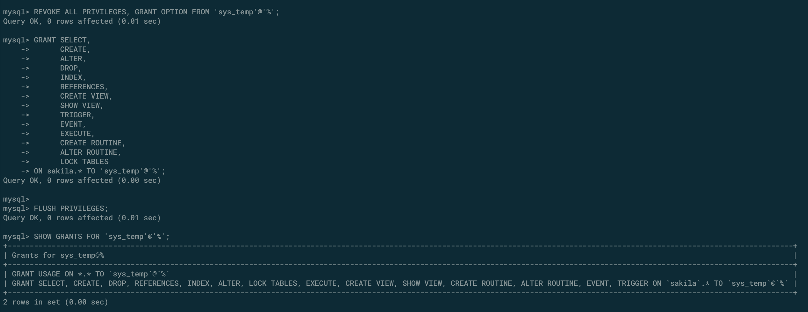

#### Простыня всех запросов
```sql
-- 3.1. Забираю все права у `sys_temp`
REVOKE ALL PRIVILEGES, GRANT OPTION FROM 'sys_temp'@'%';
-- 3.1 Выдаю только нужные и обновляю привилегии:
GRANT SELECT,
      CREATE,
      ALTER,
      DROP,
      INDEX,
      REFERENCES,
      CREATE VIEW,
      SHOW VIEW,
      TRIGGER,
      EVENT,
      EXECUTE,
      CREATE ROUTINE,
      ALTER ROUTINE,
      LOCK TABLES
      ON sakila.* TO 'sys_temp'@'%';

FLUSH PRIVILEGES;
-- 3.2. проверяю какие права есть у пользователя `sys_temp`
SHOW GRANTS FOR 'sys_temp'@'%';
```

##### Ссылки на другие ДЗ
[Домашнее задание к занятию «SQL. Часть 1»](12-03.md)

[Домашнее задание к занятию «SQL. Часть 2»](12-04.md)

[Домашнее задание к занятию «Индексы»](12-05.md)